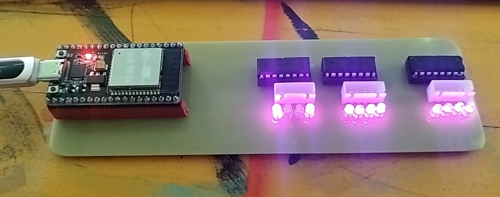

# Brushograph PCB

This repository contains the KiCad PCB design files for the Brushograph (miniPenzlograf) project, a pen-plotting device designed for creating artistic drawings and patterns.

**A DIY etchable PCB-design to run FluidNC on ESP32 including ULN2003 drivers for 3 uni-polar stepper motors (28byj-48)**

## About Brushograph

This PCB repository is part of the larger Brushograph project, which explores "Ways of painting with a mechatronic brush" - an intersection between classical artistic techniques and modern technology.

**Main Documentation:**
- [Brushograph Wiki](https://wiki.sgmk-ssam.ch/wiki/Brushograph) - Complete project documentation

## Project Structure

- `Brusograf_PCB/` - Main KiCad project directory
  - `.kicad_pcb` files - PCB layout files
  - `.kicad_sch` - Schematic files
  - `.kicad_pro` - Project files
  - `MASK/` - Contains mask files in SVG and PDF format for PCB silkscreen
- `FluidNC_config/` - Configuration for FluidNC firmware
- `photos/` - Project photos and documentation images

## Features

- Custom PCB design for the Brushograph device
- ESP32-based control board with FluidNC firmware support
- Integrated ULN2003 drivers for 3 uni-polar stepper motors (28byj-48)
- DIY etchable single-layer design for easy home fabrication
- Rounded PCB version available
- Configuration files for FluidNC firmware (custom fork for support uni-polar steppers)

## Getting Started

To view or modify the PCB design:
1. Install KiCad (version 6.0 or later recommended)
2. Open the `.kicad_pro` project file in the Brusograf_PCB directory

For complete setup instructions, including firmware and mechanical assembly, please refer to the [Brushograph Wiki](https://wiki.sgmk-ssam.ch/wiki/Brushograph).

## Related Repositories

- [FluidNC for unipolar steppers](https://git.kompot.si/g1smo/FluidNC) - Forked and reworked version of FluidNC to support uni-polar steppers

## License

[Specify license here]

## Credits

Designed by dusjagr

The Brushograph project is based on Dominik Mahnič's "Brušografia" concept, bridging traditional painting and technology.

## Contact

[Your contact information here]
