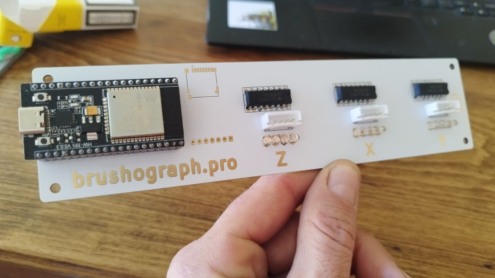

# Brushograph PCB

This repository contains the KiCad PCB design files for the Brushograph (miniPenzlograf) project, a pen-plotting device designed for creating artistic drawings and patterns.

**A manufacturing-ready PCB-design to run FluidNC on ESP32 including ULN2003 drivers for 3 uni-polar stepper motors (28byj-48)**

**A DIY etchable PCB-design to run FluidNC on ESP32 including ULN2003 drivers for 3 uni-polar stepper motors (28byj-48)**

## About Brushograph

This PCB repository is part of the larger Brushograph project, which explores "Ways of painting with a mechatronic brush" - an intersection between classical artistic techniques and modern technology.

**Main Documentation:**
- [Brushograph Wiki](https://wiki.sgmk-ssam.ch/wiki/Brushograph) - Complete project documentation

## Project Structure

- `Brusograf_PCB/` - Main KiCad project directory
  - `.kicad_pcb` files - PCB layout files
  - `.kicad_sch` - Schematic files
  - `.kicad_pro` - Project files
  - `MASK/` - Contains mask files in SVG and PDF format for PCB silkscreen
- `Brushograf_PCB-china/` - Latest KiCad project prepared for fabrication
  - `Gerber_Brusograf/` - Generated Gerber set for PCB manufacturing
  - `Gerber_Brusograf_black.zip` - Zipped Gerbers ready to upload to your PCB manufacturer
- `FluidNC_config/` - Configuration for FluidNC firmware
- `photos/` - Project photos and documentation images

## Features

- Custom PCB design for the Brushograph device
- ESP32-based control board with FluidNC firmware support
- Integrated ULN2003 drivers for 3 uni-polar stepper motors (28byj-48)
- DIY etchable single-layer design for easy home fabrication
- Rounded PCB version available
- Configuration files for FluidNC firmware (custom fork for support uni-polar steppers)

## Hardware Configuration

### ESP32 Pin Configuration

The Brushograph PCB uses the following ESP32 GPIO pins for controlling the stepper motors via ULN2003 drivers:

#### X-Axis Motor (Unipolar)
- Phase 0: GPIO 27
- Phase 1: GPIO 14
- Phase 2: GPIO 13
- Phase 3: GPIO 4

#### Y-Axis Motor (Unipolar)
- Phase 0: GPIO 16
- Phase 1: GPIO 17
- Phase 2: GPIO 21
- Phase 3: GPIO 22

#### Z-Axis Motor (Unipolar)
- Phase 0: GPIO 26
- Phase 1: GPIO 25
- Phase 2: GPIO 33
- Phase 3: GPIO 32

#### SD Card (SPI)
- MISO: GPIO 19
- MOSI: GPIO 23
- SCK: GPIO 18
- CS: GPIO 5

### Motor Configuration

The config.yaml file in the FluidNC_config directory contains all necessary settings for the stepper motors:

- X/Y Axis: 85 steps/mm, 1000mm/min max rate, 50mm/s² acceleration
- Z Axis: 78 steps/mm, 1000mm/min max rate, 30mm/s² acceleration

### 28BYJ-48 Stepper Motors

The PCB is designed specifically for the commonly available and inexpensive 28BYJ-48 unipolar stepper motors:
- 5V DC operation
- Gear reduction ratio of 1:64
- Step angle of 5.625° (64 steps per revolution)
- 4-phase operation via ULN2003 driver

## Getting Started

To view or modify the PCB design:
1. Install KiCad (version 6.0 or later recommended)
2. Open the `.kicad_pro` project file in the `Brusograf_PCB` directory
     - For the latest manufacturing-ready version, you can also open the project in `Brushograf_PCB-china/`

For complete setup instructions, including firmware and mechanical assembly, please refer to the [Brushograph Wiki](https://wiki.sgmk-ssam.ch/wiki/Brushograph).

## Manufacturing-ready files

- Latest Gerbers (ZIP, ready for fab): [`Brushograf_PCB-china/Gerber_Brusograf_black.zip`](Brushograf_PCB-china/Gerber_Brusograf_black.zip)
- Gerber folder (all layers and drill files): [`Brushograf_PCB-china/Gerber_Brusograf/`](Brushograf_PCB-china/Gerber_Brusograf/)

## Related Repositories

- [FluidNC for unipolar steppers](https://git.kompot.si/g1smo/FluidNC) - Forked and reworked version of FluidNC to support uni-polar steppers

## License

[Specify license here]

## Credits

Designed by dusjagr

The Brushograph project is based on Dominik Mahnič's "Brušografia" concept, bridging traditional painting and technology.

## Contact

[Your contact information here]
